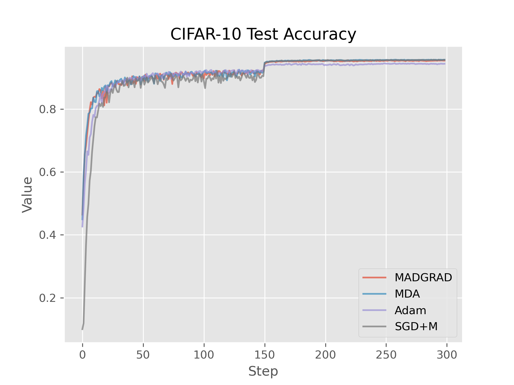

# FTRL Techniques for Deep Learning

Shashank Manjunath  
manjuns@bu.edu

## Introduction

This project is concerned with studying Follow the Regularized Leader (FTRL)/Dual Averaging algorithms applied to deep
learning. So far, we have tested two dual averaging algorithms, Modernized Dual Averaging (MDA) ([Jelassi et. al.,
2020](http://arxiv.org/abs/2010.10502)) and MADGRAD ([DeFazio et. al., 2021](https://arxiv.org/pdf/2101.11075.pdf)),
which use FTRL style algorithms in order to optimize non-convex deep learning algorithms. For this project, we have
focused on both implementing these algorithms in PyTorch and testing them out on the CIFAR10 dataset.

## Implementations

So far, we have successfully replicated results on the CIFAR10 dataset for the MDA, MADGRAD and Stochastic Gradient
Descent with Momentum (SGD+M) algorithms. We show our test accuracy and test loss results in the plot below.

Test Accuracy                             | Test Loss
:-------------------------:               | :-------------------------:
 | 
